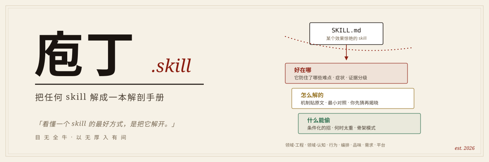

<div align="center">

# 庖丁.skill

<p align="center">
  
</p>

> *「看懂一个 skill 的最好方式，是把它解开。」*

[](LICENSE)
[](https://claude.ai/code)

<br>

**把任何一个 AI skill 解成一本讲透三件事的解剖手册：效果好在哪、怎么解的、什么能偷。**

<br>

你收藏了 100 个 skill，说不出其中任何一个为什么好用。<br>
软件工程时代你还能钻进源码——但 skill 没有源码可读。<br>
skill 的「源码」，是它对模型默认行为的改变。庖丁读的就是这个。

[看效果](#解剖出来的东西长什么样) · [解剖样例](#解剖样例女娲skill) · [它怎么看一个-skill](#它怎么看一个-skill) · [安装](#安装与使用)

</div>

---

## 解剖出来的东西长什么样

不是摘要，不是功能清单。先看一张「难点预览卡」——手册第一章就这样开场：

```
### 像不像不是问题，编不编才是

坑 ❯ 你问人设：「Vision Pro 现在值不值得做？」
     它答：「人们不知道自己想要什么，直到你把它放到他们面前。值得做。」
     ——流畅、像他，但没查任何最新事实，纯编的，而且你看不出来。

最值得学的一招 ❯ 它给生成的人设写死一条「回答工作流」：需要事实的问题
     必须先用工具查再答，研究维度还是从这个人的心智模型反推的——
     芒格查激励结构，塔勒布查尾部风险，不是通用的「搜索相关信息」。

维度 ❯ 领域-认知        深入 ❯ 运行轨迹第 6 站 · 档案 A1
```

再看一张「难点档案卡」的核心三段——症状必须是能上演的场景，机制必须贴原文，证据必须定级：

```
症状（基线会怎么坏）❯ 提炼时我想引用 Agent 2 找到的那段 1995 年访谈原话，
     翻遍上下文，只剩它当时汇报的一句「已完成对话维度调研」——
     原话、出处、上下文全没了。                      （证据：作者证词）

skill 怎么解（贴原文）❯ 「每个 subagent 必须把调研结果写入对应的 md 文件。
     不存文件的调研等于没做。」

可偷的招 ❯ 当多个并行 agent 的产出要被下游消费时 →
     开工前先钉死产物的文件名和位置，先有住址再有居民。
```

每个论断都带证据等级（实测／作者证词／结构推断／假设）——**是推断的就标推断，是猜的就标猜的**。读者拿走的不是「这个 skill 很棒」，是一套能搬进自己项目的、条件化的招。

---

## 解剖样例：女娲.skill

[女娲.skill](https://github.com/alchaincyf/nuwa-skill) 把一个人名变成一个人物 skill，效果惊艳。但它**为什么**好用？

挑它开刀只有一个原因：公认效果好、材料齐全、值得精读——这是第一个标本，不是最后一个。庖丁把它整个解开了——产出是一本可以直接在浏览器里翻的解剖手册（`generation/huashu-nuwa/`，本地起个服务就能看），五章 + 附录：

| 章 | 回答的问题 |
|---|---|
| **Overview** | 没有它会怎样？（现象先行：先看默认 AI 怎么编出一个假乔布斯） |
| **Walkthrough** | 它怎么跑？（六站逐站下钻：场景 → 难点 → **你先猜** → 机制贴原文 → 可偷的招） |
| **中间产物与数据流** | 为什么调研要写进六个固定文件？为什么中间产物是「思维模型」不是「语录集」？ |
| **难点档案** | 11 张卡，七个维度全覆盖——章末是诚实账：**没过判定的残渣 + 它没防住的盲区** |
| **Apply It** | 骨架模式 + 迁移练习：换成「公司尽调」领域，你自己画一遍 |
| **附录 · 术语表** | 那个词什么意思？（查阅用，不在主线上：每条 5 个字段——定义／出现在哪个 stage／解决什么／怎么用／容易误解） |

从这本手册里能拆出来的，比如：女娲最深的一招不是流程，是**表征选择**——中间产物选「DNA」不选「金句」，因为金句人设遇到新问题就崩；它的两个检查点不是随便放的，钉在「主观判断最重、下游返工最贵」的接缝上；它的信息源黑名单是一块**平台伤疤**——可迁移的是「按生态失真率管控来源」的结构，名单本身搬不走。

---

## 它怎么看一个 skill

「效果好在哪」的答案，就是「它防住了哪些别人会死的难点」。所以庖丁不读功能，读反事实。对包里的每条规则、每个脚本、每个中间产物，过三问：

```
① 去掉它，第一个坏掉的产物是什么？（必须写成可观察的症状，禁止「这一步很难」）
② 这个坏结果对基线是默认发生，还是小概率？（不发生 → 砍掉候选）
③ 凭什么相信？（实测 / 作者证词 / 结构推断 / 假设——四级证据，猜的标猜）
```

难点按来源分七个维度——任务难（工程／认知）、执行者不可靠（行为）、规模超上下文（编排）、「好」说不清（品味）、输入残缺（需求）、环境怪癖（平台）。**逐条对账保覆盖：归不进任何维度的条目进残渣清单，残渣反复出现说明框架该升版**——这套分类法自己也是可证伪的。

外加两条挖掘直觉：

- **任何「具体得可疑」的细节，背后都是一个踩过的坑**——「每张 ≥4 色」「漂白阈值」这种规则没人凭空写得出来；
- **任何「反直觉的中间产物」，背后都是一个领域洞察**——流水线生产了一个你裸做时根本不会想到的东西？那里埋着这个 skill 对任务本质的理解。

光靠读文本，证据等级永远卡在「作者证词／结构推断」——读文档是尸检，结构可见、行为不可见。所以庖丁有一把**证据获取的梯子**，按「证据提升 × 教学价值 ÷ 复现成本」决定爬到哪级：

```
① 尸检      读 SKILL.md / references / scripts
② 标本采集  挖源包 examples/、README 成品图——先挖现成的，再谈合成
③ 活体切片  真跑 skill，跑到第一个承重工件为止、沿人工检查点切开，只认落盘产物不认口头汇报
④ 定点消融  去掉单条机制、只跑它护住的那一段，看它声称防住的症状是否真的出现
```

消融的单位是一条机制不是整个 skill，切片停在第一个承重工件——都不是全跑，成本是全跑的零头。实践里这两级很值：一次切片能真跑出地基工件和检查点话术，把"产出长什么样"从示意变实物；两次几分钟级的消融能把一张卡从作者证词升成带对照图的实测，顺手还会暴露光读文档发现不了的盲区。合成的样本必须标「模拟样本」——是猜的标猜，对手册自己同样生效。

手册的教学法也有讲究：口吻是对话体，骨子是参与式——每个机制揭晓前强制你先猜（猜错一次比听懂十次记得牢，这条是构建层硬约束，缺了直接构建失败），底气是证据体——每个论断后面跟着原文引用和真实样本。概念必须可触摸：每个承重工件只在一处放一份**逐字段注释的真实标本**（这个字段封存什么设计决策、写坏了下游谁先死），术语表每条必须带实例——「全书目录的结构化文件」这种看了等于没看的定义，过不了构建。

**一本不告诉你哪里是猜的解剖手册，不值得信任。** 所以每本手册的难点档案，最后一节永远是它没防住的盲区。

---

## 安装与使用

```bash
git clone https://github.com/longyunfeigu/paoding-skill.git ~/.claude/skills/paoding
```

然后在 Claude Code 里：

```
> 用庖丁解一下 /path/to/some-skill        # 默认给最轻的有用产出
> 帮我评审这个 skill，哪些该删该留          # Keep/Cut 评审
> 把这个 skill 的可迁移模式提出来           # 难点卡片
> 给这个 skill 做一本解剖手册              # 五章 Web 手册（重产出）
```

三种产出按需取用，手册是输出模式，不是这个 skill 的本体。

---

## 生产流水线（Web 手册模式）

内容只手写一层（`content/*.md`），其余全部生成，违规被机器拦下：

```bash
bash scripts/scaffold-web-app.sh generation/<slug> --title="..." --source-path="..."
python3 scripts/build-data.py  generation/<slug>    # content → data.js（构建产物，禁止手写）
python3 scripts/check-content.py generation/<slug>  # 硬 gate：证据等级 / 对照成对 / 指针不悬空
python3 -m http.server --directory generation/<slug> 8000
```

构建层强制、不靠自觉的事：症状缺证据标记 → 拒绝；有难点的站缺预测点 → 拒绝；术语缺实例 → 拒绝；场景再现没有实物片段 → 拒绝；预览卡指向不存在的章节 → 拒绝；引用的 SVG 不存在 → 拒绝；预览卡和档案卡近乎逐字复读 → 点名警告。

为什么越收越紧：解第二个 skill 时发现，凡是只写在规格里、没进 gate 的教学规则——术语带例、贴实物、三高度不复读——第二本就全丢了。**没进 gate 的规则必然退化**，这是庖丁自己的命题在自己身上的验证，所以它们都进了 gate。

## 仓库结构

```
paoding/
├── SKILL.md                      # 入口：何时用、工作流、红线
├── references/
│   ├── pain-dimensions.md        # 方法论核心：六维框架 + 三问判定 + 证据分级
│   ├── evidence-collection.md    # 证据获取阶梯：挖标本 / 活体切片 / 定点消融
│   ├── handbook-spec.md          # 五章手册的内容契约
│   ├── content-format.md         # 写作 AI / 构建脚本 / 渲染器的三方契约
│   ├── voice-style-gate.md       # 七条硬规则 + 反黑话 + 教学口吻检查
│   └── ...
├── scripts/                      # scaffold / 构建 / 机器 gate
├── assets/web-app-template/      # 编辑杂志体模板（纸色 + 单一深红 + 暗色代码反差）
├── generation/huashu-nuwa/       # ⭐ 样例：女娲的完整解剖手册
└── tests/                        # 全链路回归
```

## 背后的故事

软件复杂到一定程度的时候，这个行业长出了两个传统：读源码，和把读出来的东西沉淀成设计模式。GoF 那本书不是发明了 23 个模式，是把散落在无数优秀代码里的招式起了名字、定了边界——从此工匠的手艺变成了可传授的学科。

skill 正走到同一个节拍上。开源 skill 越来越多，效果一个比一个惊艳，但它们没有源码可读——skill 的逻辑不在代码里，在它怎么改变模型的默认行为里。光看文本，你只能看到"它让 agent 做了什么"，看不到"没有这行字，模型默认会犯什么错"。

所以需要一种新的读法：以前钻源码学软件设计模式，现在拆 skill 学 **skill 设计模式**。每解一个 skill，沉淀一批带证据、带适用边界的招——解得多了，这些招会汇成一本跨 skill 的 cookbook。这是庖丁的由来，也是它的路线图。

## 许可证

Apache 2.0 — 随便用，随便改，随便解。

---

<div align="center">

**同事.skill** 证明了人可以被蒸馏。<br>
**女娲** 蒸馏人怎么想，**达尔文** 让 skill 进化。<br>
**庖丁** 解的是——这些 skill 本身怎么想。<br><br>
女娲造的 skill，庖丁来解。解完，你也能造。<br><br>
*「臣之所好者道也，进乎技矣。」*

</div>
