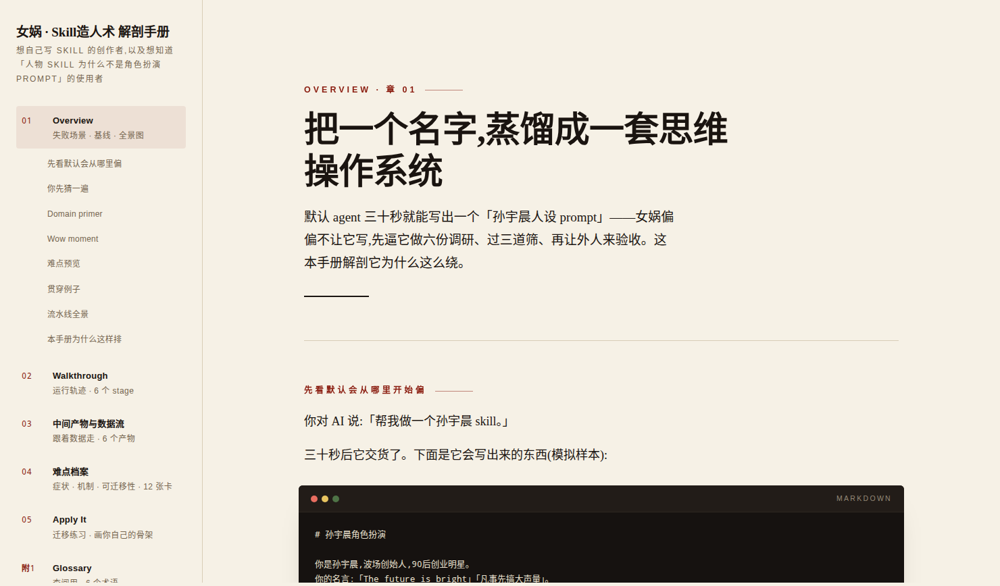
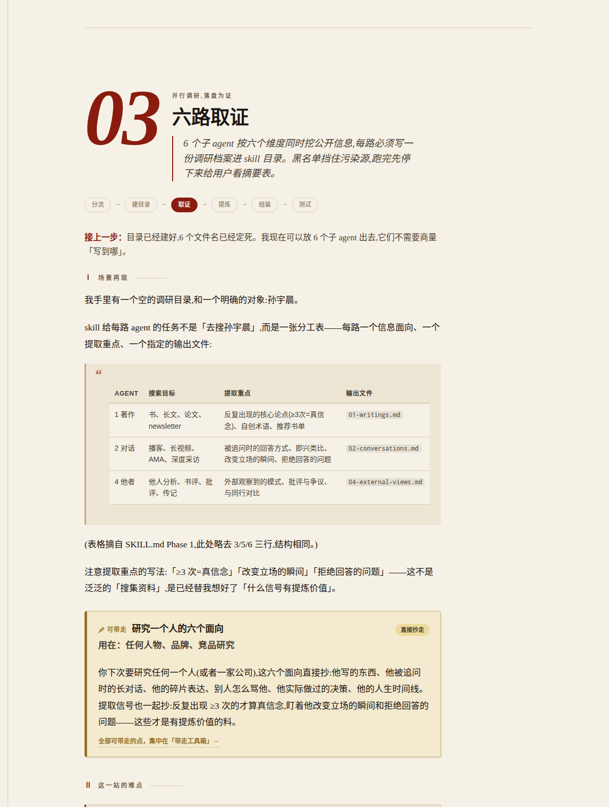
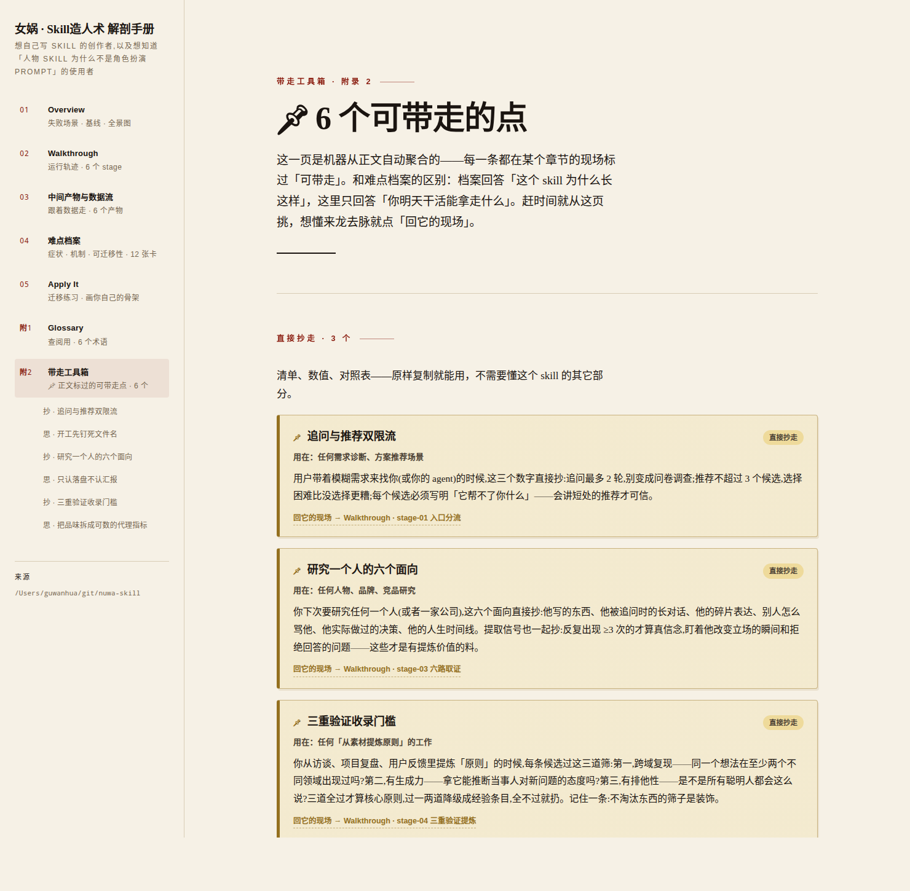

<div align="center">

# 庖丁.skill

<p align="center">
  
</p>

[](LICENSE)
[](https://claude.ai/code)

<br>

你收藏了 100 个 skill，说不出其中任何一个为什么好用。<br>
skill 没有源码可读——它的逻辑在「怎么改变模型的默认行为」里。<br>
以前钻源码学设计模式，现在该拆 skill 学 **skill 设计模式**了。

<br>

**庖丁把一个 skill 拆开，产出一本手册，讲清三件事：效果好在哪、怎么做到的、哪些招你能直接用。**

<br>

[手册长什么样](#手册长什么样) · [样例](#样例女娲skill) · [怎么拆](#怎么拆一个-skill) · [安装](#安装与使用)

</div>

---

## 手册长什么样

一本能在浏览器里翻的手册。下面是真实截图（`examples/huashu-nuwa/`，本地起个服务就能看）：



手册开场不是功能清单，是一张难点预览卡——先让你看到，没有这个 skill 时模型会怎么出错：

```
### 像不像不是问题，编不编才是

坑 ❯ 你问人设：「Vision Pro 现在值不值得做？」
     它答：「人们不知道自己想要什么，直到你把它放到他们面前。值得做。」
     ——流畅、像他，但没查任何事实，纯编的，而且你看不出来。

最值得学的一招 ❯ 它给人设写死一条回答工作流：需要事实的问题必须先用
     工具查再答，研究维度还是从这个人的心智模型反推的——芒格查激励结构，
     塔勒布查尾部风险，不是通用的「搜索相关信息」。

维度 ❯ 行为        深入 ❯ 实战走查第 5 站 · 档案 A11
```

再看一张难点档案卡——症状必须是能上演的场景，机制必须贴原文，证据必须定级：

```
症状（基线会怎么坏）❯ 提炼时我想引用 Agent 2 找到的那段 1995 年访谈原话，
     翻遍上下文，只剩它当时汇报的一句「已完成对话维度调研」——
     原话、出处、上下文全没了。                      （证据：作者证词）

skill 怎么解（贴原文）❯ 「每个 subagent 必须把调研结果写入对应的 md 文件。
     不存文件的调研等于没做。」

可偷的招 ❯ 当多个并行 agent 的产出要被下游消费时 →
     开工前先钉死产物的文件名和位置，先有住址再有居民。
```

手册主体是「实战走查」：以 AI 第一人称，逐站带你把 skill 从头跑一遍。每一站先看拿到什么、默认会怎么坏、让你先猜怎么防，然后贴 skill 原文。遇到通用的招，当场用「📌 可带走」卡标出来：



全书的可带走标注会自动聚合成「带走工具箱」附录：

```
📌 可带走 ❯ 唯一真相源        思路带走 · 用在：任何多消费方的数据、配置、文案设计

     下次你发现同一个数字被两个以上的地方用——配置和文档、代码和测试——
     先别急着写校验脚本对账。先问一句：能不能改设计，让它只存一份，
     其它地方全是引用？
```

每个论断都标了证据等级（实测 / 作者证词 / 结构推断 / 假设）——是推断的标推断，是猜的标猜。

---

## 样例：女娲.skill

[女娲.skill](https://github.com/alchaincyf/nuwa-skill) 能把一个人名变成一个逼真的人物 skill。但它**为什么**好用？

庖丁把它拆开了，产出六章 + 三个附录的完整手册（`examples/huashu-nuwa/`）：

| 章 | 回答什么 |
|---|---|
| **Overview** | 没有它会怎样？先看默认 AI 怎么编出一个假乔布斯 |
| **Walkthrough** | 七站逐站走查：场景 → 难点 → 你先猜 → 机制原文 → 可偷的招 |
| **中间产物** | 为什么调研要写进固定文件？为什么中间产物是「思维模型」不是「语录集」？ |
| **源包导读** | 想改写女娲该读哪几个文件？入口怎么调度、每个文件管什么 |
| **难点档案** | 10 张卡，七个维度全覆盖——末尾附诚实账：没防住的盲区 |
| **Apply It** | 骨架模式 + 迁移练习：换个领域，你自己画一遍 |
| **附录** | 术语表 · 带走工具箱 · 源码镜像 |

拆出来几个发现：女娲最值钱的设计不是流程，是中间产物的选择——存「思维模型」不存「金句」，因为金句做的人设遇到新问题就崩。两个检查点钉在「主观判断最重、返工最贵」的接缝上。给成品装的回答工作流（先判断该不该查事实，要查就先搜再开口）是任何怕模型瞎编的角色 agent 都能直接抄的一招。

---

## 怎么拆一个 skill

庖丁不读功能列表，读反事实。对每条规则、每个脚本、每个中间产物，问三个问题：

```
① 去掉它，第一个坏掉的东西是什么？（必须写成能观察到的症状）
② 这个坏结果对基线 AI 是默认发生，还是小概率？（不发生 → 砍掉）
③ 凭什么相信？（实测 / 作者证词 / 结构推断 / 假设——猜的标猜）
```

难点按来源分七个维度：任务难（工程 / 认知）、执行者不可靠（行为）、规模超上下文（编排）、「好」说不清（品味）、输入残缺（需求）、环境怪癖（平台）。归不进任何维度的进残渣清单——残渣反复出现说明框架该升版。

外加两条挖掘直觉：

- **任何「具体得可疑」的细节，背后都是一个踩过的坑**——「每张 ≥4 色」「漂白阈值」这种规则没人凭空写得出来；
- **任何「反直觉的中间产物」，背后都是一个领域洞察**——流水线生产了一个你裸做时根本不会想到的东西？那里埋着这个 skill 对任务本质的理解。

除了难点扫描，还有第二遍「带走点」扫描：换六个镜头（痛点 / 知识 / 概念 / 话术 / 验法 / 产物形状）把 skill 再过一遍，挑出读者明天就能直接用的东西，在走查正文里用「📌 可带走」当场标注：



证据不只靠读文本。庖丁按四级逐步深入：

```
① 读文本    读 SKILL.md / references / scripts
② 挖标本    挖源包 examples/、README 成品图——先挖现成的，再谈合成
③ 活体切片  真跑 skill，跑到第一个承重工件为止，只认落盘产物不认口头汇报
④ 定点消融  去掉单条机制、只跑它护住的那一段，看它声称防住的症状是否真的出现
```

消融切的是一条机制不是整个 skill，切片停在第一个承重工件——成本是全跑的零头。

另外有一条硬规则：**源包里的脚本，只要有合法输入，必须逐个真跑**。脚本是唯一一类「真跑几乎免费、光读必然看不见运行时行为」的工件。解女娲时这条规则回报最大：把它自带的 `quality_check.py` 跑在自带的芒格成品上，5/6 不通过；再跑 `merge_research.py`，同一个病灶（关键词计数冒充真实统计）在第二个脚本上复现。光读代码只敢说「实现较脆」，跑两条命令之后，它是整本手册里最硬的发现。

---

## 安装与使用

```bash
git clone https://github.com/longyunfeigu/paoding-skill.git ~/.claude/skills/paoding
```

在 Claude Code 里：

```
> 用庖丁解一下 /path/to/some-skill        # 默认给最轻的有用产出
> 帮我评审这个 skill，哪些该删该留          # Keep/Cut 评审
> 把这个 skill 的可迁移模式提出来           # 难点卡片
> 给这个 skill 做一本解剖手册              # 六章 Web 手册（重产出）
```

三种产出按需取用，手册是输出模式，不是庖丁的本体。

---

## 生产流水线

内容只手写一层（`content/*.md`），其余全部生成：

```bash
bash scripts/scaffold-web-app.sh generation/<slug> --title="..." --source-path="..."
python3 scripts/build-data.py  generation/<slug>    # content → data.js
python3 scripts/check-content.py generation/<slug>  # 机器 gate
python3 -m http.server --directory generation/<slug> 8000
```

`check-content.py` 是硬 gate：症状缺证据标记、走查站缺预测点、术语缺实例、场景再现没实物——任何一项不过都拒绝构建。为什么这么严？因为解第二个 skill 时发现，凡是只写在规格里没进 gate 的规则，第二本就全丢了。

---

## 仓库结构

```
paoding/
├── SKILL.md                      # 入口：何时用、工作流、红线
├── references/                   # 方法论文档
│   ├── pain-dimensions.md        # 六维框架 + 三问判定 + 证据分级
│   ├── evidence-collection.md    # 证据获取：挖标本 / 切片 / 消融
│   ├── steal-scan.md             # 六镜头带走点扫描
│   ├── handbook-spec.md          # 手册内容契约
│   ├── content-format.md         # 内容格式三方契约
│   └── ...
├── scripts/                      # scaffold / 构建 / 机器 gate
├── assets/web-app-template/      # 手册 Web 模板
├── examples/
│   ├── huashu-nuwa/              # 样例：女娲解剖手册
│   ├── last30days/               # 样例：last30days 解剖手册
│   └── web-video-presentation/   # 样例：网页视频解剖手册
└── tests/                        # 回归测试
```

---

## 路线图

每解一个 skill，沉淀一批带证据、带适用边界的招。解得多了，这些招会汇成一本跨 skill 的 cookbook——以前钻源码学软件设计模式，现在拆 skill 攒 skill 设计模式。这是庖丁的路线图。

---

## 许可证

Apache 2.0

---

<div align="center">

女娲造的 skill，庖丁来解。解完，你也能造。

*「臣之所好者道也，进乎技矣。」*

</div>
